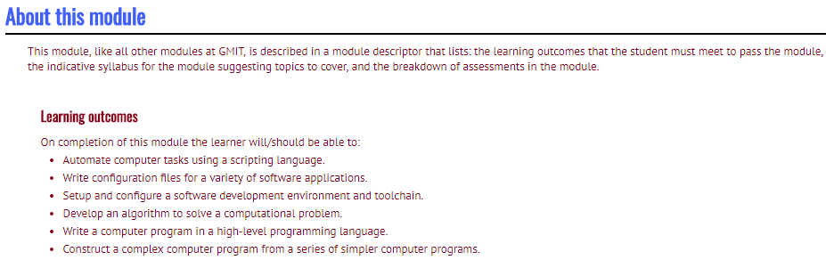

# *GMIT-Programming and Scripting Module*
# *Higher Diploma in Data Analytics*

## Exercise 1 and 2
  - Change a [Python](https://www.python.org/) program to calculate the nth Fibonacci number where n the sum of the first and last letters of my name,where the letter is numbered
  - Change the string variable in a program thats contains my surname and rerun the program.

## Exercise 3
  - Write a Python script that starts with an integer and repeatedly applies the [Collatz](https://en.wikipedia.org/wiki/Collatz_conjecture) function (divide by 2 if even, multiply by three and 1 if odd) using a while loop and if statement. At each iteration, the current value of the integer should be printed to the screen. You can specify in your code the starting value of 17.

## Exercise 4
  - Problem 5 from [Project Euler](https://projecteuler.net/). 2,520 is the smallest number that can be divided by each of the numbers from 1 to 10 without any remainder. Write a Python program using for and range to calculate the smallest positive number that is evenly divisible by all of the numbers from 1 to 20. 
  
## Exercise 5
  - Write a Python script that reads the [Iris data set](https://en.wikipedia.org/wiki/Iris_flower_data_set) in and prints the four numerical values on each row in a nice format. That is, on the screen should be printed the petal length, petal width, sepal length and sepal width, and these values should have the decimal places aligned, with a space between the columns
  - The data set is included is this [file.](iris.txt)

## Exercise 6
  - Write a Python script containing a function called factorial() that takes a single input/argument which is a positive integer and returns its factorial. The factorial of a number is that number multiplied by all of the positive numbers less than it. For example, the factorial of 5 is 5x4x3x2x1 which equals 120. You should, in your script, test the function by calling it with the values 5, 7, and 10.
